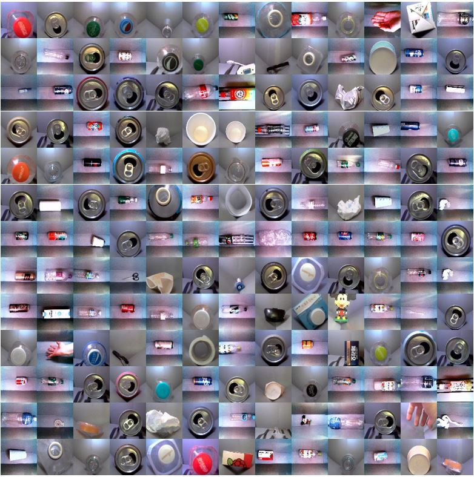
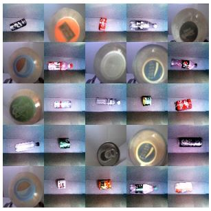

# Dataset for Waste Classification

This is a dataset for waste classification in reverse vending machine (RVM), consisting of 3,084 images. We constructed and published this dataset to serve as a baseline dataset of studies for `reverse vending machine`, and `waste classification`. The images are preprocessed with cropping or changing brightness(if needed) to highlight objects better.

To construct our dataset, we built the prototype RVM and collected the resources on our own. The objects are recycling resources that can be found on Republic of Korea(south).

The figure below is the samples of our dataset.

## Composition of dataset
- The images are divided into the top view(2592x1944p) and the front view(1280x720p) primary.
- The top view and the front view are further divided into aluminum cans, PET, non-target objects
- Non-target objects are inappropriate object(IAO) and intentional fraud objects.

### train dataset
- 850 Aluminum can
- 810 PET
- 636 Non-target(Inappropriate objects)

### test dataset
- 264 Aluminum can
- 264 PET
- 140 Non-target objects(fraud objects)
- 120 Non-target objects(Inappropriate objects)

## Intentional fraud objects

The fraud objects represent the intentionally made look-alike objects to fool the classification system. They are printed PET beverage containers, printed aluminum cans, and objects made with only the label of the PET beverage container. The printed look-alike frauds are printed in color or grayscale.

The figure below is the samples of intentional frauds. They may look same as general PET or aluminum cans, but they are all printed look-alike frauds.

## Download

If you are using our dataset, please give a citation:

    @article{yoo2021dual,
        title={Dual Image-Based CNN Ensemble Model for Waste Classification in Reverse Vending Machine},
        author={Yoo, Taeyoung and Lee, Seongjae and Kim, Taehyoun},
        journal={Applied Sciences},
        volume={11},
        number={22},
        pages={11051},
        year={2021},
        publisher={Multidisciplinary Digital Publishing Institute}
    }
    
You can download the dataset [here](https://drive.google.com/drive/folders/1a2QQL3Nd8GYCUrMPWDopDkoM6xpf-HFj?usp=sharing).
